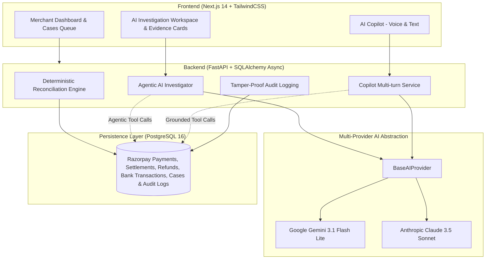

# ⚡ Reconciliation Investigator (Razorpay AI Buildathon)

> **Autonomous AI-Powered Financial Reconciliation & Discrepancy Investigation System for Razorpay Merchants.**

[](https://fastapi.tiangolo.com)
[](https://nextjs.org)
[](https://www.postgresql.org)
[](https://ai.google.dev)
[](https://anthropic.com)
[]()

---

## 📌 Executive Summary

Every high-growth merchant on Razorpay processes thousands of transactions daily. However, **reconciling payments, settlements, platform fees, GST deductions, refunds, and bank statements** remains one of the largest operational bottlenecks in fintech.

**Reconciliation Investigator** bridges this gap through a dual-engine architecture:
1. **Deterministic Rule Engine (Phase 1–6)**: Instantly matches 75%+ of standard transactions using deterministic banking rules (UTR matches, fee/tax tolerances, refund netting).
2. **Agentic AI Investigator**: For ambiguous discrepancies (`NEEDS_REVIEW`), an autonomous LLM agent uses real database tools to investigate root causes, generate grounded financial evidence, assign confidence scores, and propose corrective actions.
3. **AI Copilot (Voice + Text)**: A conversational analytics assistant enabling merchants to query anomalies, high-value mismatches, and batch summaries in real-time.

---

## 🏛️ System Architecture



---

## ✨ Key Features & Highlights

### 1. 🔍 Agentic AI Investigator with Database Tools
Rather than relying on generic one-shot prompts, the AI operates inside an **agentic tool-use loop** equipped with database query functions:
- `get_payment(payment_id)`
- `get_settlement(settlement_id)`
- `get_refunds(payment_id)`
- `search_bank_transactions(utr, date, amount)`
- `get_reconciliation_case(case_id)`
- `calculate_expected_settlement(case_id)`
- `submit_investigation_result(structured_json)`

### 2. 🛡️ Strict Financial Hallucination Guardrails
In financial systems, invented transaction IDs or false UTR numbers are disastrous. 
- **Tool Grounding Verification**: The backend cross-checks every `(source_type, source_id)` in the AI's final submission against the set of IDs **actually returned by tool executions**.
- Any hallucinated reference triggers immediate server-side rejection before persisting or presenting to the human reviewer.

### 3. ⚖️ Human-in-the-Loop Decision Workflow & Audit Logs
- The AI never unilaterally modifies financial ledger state.
- It surfaces: **Root Cause** (`FEE_TAX`, `REFUND`, `MISSING_BANK_CREDIT`, `TIMING_DIFFERENCE`), **Explanation**, **Confidence Gauge (High/Medium/Low)**, and **Recommended Action**.
- Merchants can `ACCEPT & RESOLVE`, `FLAG FOR REVIEW`, or `REJECT` findings. Every state transition is recorded in immutable, append-only **Audit Logs**.

### 4. 🎙️ AI Copilot with Real-Time Voice & Text
- Natural language query interface powered by the Web Speech API and Gemini.
- Supports questions like:
  - *"What needs attention today?"*
  - *"Show high-value exceptions"*
  - *"Explain today's reconciliation rate"*
- Returns grounded summary cards and direct navigation links to offending cases.

### 5. 🔄 Pluggable Multi-Provider LLM Abstraction
Seamlessly switch providers in `backend/.env` without modifying business logic:
- `AI_PROVIDER=gemini` (Google GenAI SDK with sub-second execution & free tier compatibility)
- `AI_PROVIDER=anthropic` (Anthropic Claude SDK)

---

## 🧪 Comprehensive Test Suite & Deterministic Benchmarks

The codebase includes **57 automated test suites** covering:
- Ground-truth synthetic evaluation (100 synthetic transactions with 100% ground-truth accuracy).
- Provider switching, tool invocation, and mock client workflows.
- Hallucination rejection benchmarks.
- Bank statement CSV parsing tolerances (HDFC, ICICI, SBI formats).
- Webhook HMAC SHA256 signature verification.

```bash
cd backend
.venv/bin/pytest -v
# ======================== 57 passed in 0.68s ========================
```

---

## 🛠️ Tech Stack & Prerequisites

- **Backend**: Python 3.12, FastAPI, SQLAlchemy 2.0 (Asyncpg), Pydantic v2, Google GenAI SDK (`google-genai`), Anthropic SDK.
- **Frontend**: Next.js 14 (App Router), TypeScript, TailwindCSS, Lucide Icons, Web Speech API.
- **Database**: PostgreSQL 16 (Dockerized).
- **Environment Management**: Python venv, Node.js 18+.

---

## 🚀 Quickstart & Setup Guide

### 1. Clone & Start Database
```bash
git clone https://github.com/your-username/reconciliation-investigator.git
cd reconciliation-investigator

# Start PostgreSQL 16 via Docker
docker-compose up -d
```

### 2. Backend Setup
```bash
cd backend

# Create virtual environment and install dependencies
python3 -m venv .venv
source .venv/bin/activate
pip install -r requirements.txt

# Configure environment
cp .env.example .env
# Add your GEMINI_API_KEY in backend/.env

# Run database migrations / init
python3 -c "import asyncio; from app.db.init_db import init_db; asyncio.run(init_db())"

# Start FastAPI server
uvicorn app.main:app --host 0.0.0.0 --port 8000 --reload
```

### 3. Frontend Setup
```bash
cd ../frontend
npm install
npm run dev
```

Visit **`http://localhost:3000`** in your browser.

---

## 💡 Engineering Challenges & Solutions

| Challenge | How It Was Solved |
| :--- | :--- |
| **LLM Hallucinations in Financial Evidence** | Implemented a strict set tracker during tool dispatch. The final payload validator ensures 100% of cited UTRs/Payments were surfaced by real DB rows. |
| **Multi-Turn Thought Signature Loss (Gemini 3.x)** | Normalized raw model candidate parts and content blocks so reasoning signatures are preserved across multi-turn tool loops. |
| **PostgreSQL Async Type Mismatches** | Auto-parsed ISO date strings into native `datetime.date` objects before querying asyncpg to prevent operator mismatch exceptions. |
| **Reconciliation Multi-Run Idempotency** | Scoped dashboard metrics, exceptions, and analytics to the target `ReconciliationRun` ID to prevent double-counting across repeated runs while preserving historical audit trails. |

---

## 👨‍💻 Author & Contact

- **Author**: Priyanshu kumar
- **Event**: Razorpay AI Buildathon 2026
- - **Repository**: [github.com/Priyanshu2004454/reconciliation-investigator](https://github.com/Priyanshu2004454/reconciliation-investigator)